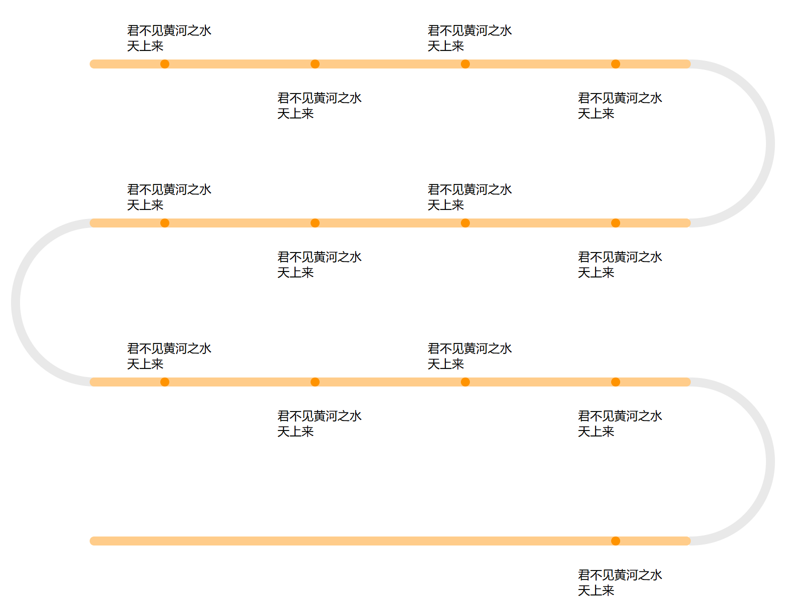
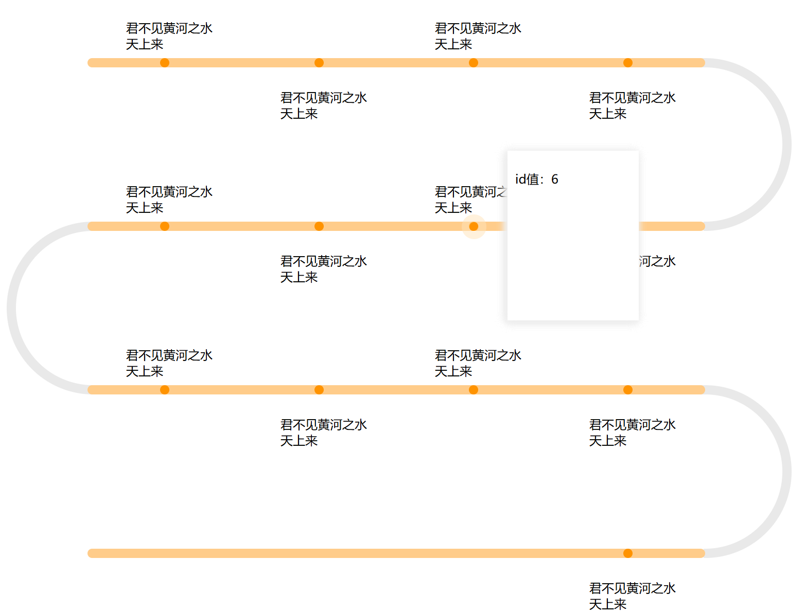

 
:::info 
根据客户需求开发一个横向S型的流程图，流程长度不定。
:::



## 1. 分析
> - 根据图，我将其分成以下几部分完成：一是横向的长条，二是长条上的标点，三是连接不同行长条之间的半圆。
> - 根据需求原型，每一行显示四个节点，所以需要对后端返回的数据内容进行处理，重新划分为二维数组，数组内部的每一个数组包含四个元素，最后一个数组包含小于等于四个。
> - 流程的弯折是S型的，所以需要两个不同方向的半圆。
> - 标点上方显示的内容以及鼠标悬浮在标点上时的面板。
> - 上下交错显示的基础信息。

## 2. 实现
### 2.1 父组件
:::details 流程图整体
```vue
<template>
  <div class="process" v-for="(line, index) in twoDArray" :key="index">
    <Line :lineList="line" class="line" :lineIndex="index" :total="twoDArray.length" @view-details="viewDetails"
      @hidden-details="hiddenDetails"></Line>
    <tooltipBox class="float-box" v-if="showDetails" :style="{ top: showX, left: showY }" :details="details"></tooltipBox>
  </div>

</template>

<script setup name="process">
import Line from './Line.vue'
import tooltipBox from './tooltipBox.vue';
import { ref } from 'vue'
const list = ref([
  { id: '1', time: '2022-08-01', name: '张三', age: 18, address: '北京市朝阳区', remark: '备注1' },
  { id: '2', time: '2022-08-02', name: '李四', age: 20, address: '上海市浦东区', remark: '备注2' },
  { id: '3', time: '2022-08-03', name: '王五', age: 22, address: '深圳市福田区', remark: '备注3' },
  { id: '4', time: '2022-08-04', name: '赵六', age: 24, address: '广州市天河区', remark: '备注4' },
  { id: '5', time: '2022-08-05', name: '钱七', age: 26, address: '武汉市洪山区', remark: '备注5' },
  { id: '6', time: '2022-08-06', name: '孙八', age: 28, address: '成都市武侯区', remark: '备注6' },
  { id: '7', time: '2022-08-07', name: '周九', age: 30, address: '重庆市渝中区', remark: '备注7' },
  { id: '8', time: '2022-08-08', name: '吴十', age: 32, address: '西安市雁塔区', remark: '备注8' },
  { id: '9', time: '2022-08-09', name: '郑十一', age: 34, address: '杭州市西湖区', remark: '备注9' },
  { id: '10', time: '2022-08-10', name: '王十二', age: 36, address: '南京市玄武区', remark: '备注10' },
  { id: '11', time: '2022-08-11', name: '冯十三', age: 38, address: '合肥市瑶海区', remark: '备注11' },
  { id: '12', time: '2022-08-12', name: '陈十四', age: 40, address: '济南市历下区', remark: '备注12' },
  { id: '13', time: '2022-08-13', name: '卫十五', age: 42, address: '青岛市市北区', remark: '备注13' },
])
const showDetails = ref(false)
const showX = ref('')
const showY = ref('')
const details = ref({})
function to2DArrayDynamic(arr) {
  let result = [];
  for (let i = 0; i < arr.length; i += 4) {
    result.push(arr.slice(i, Math.min(i + 4, arr.length)));
  }
  return result;
}
// 示例
const twoDArray = to2DArrayDynamic(list.value);
function viewDetails(e, data) {
  showX.value = e.pageY < 100 ? 0 : e.pageY - 100 + 'px'
  showY.value = e.pageX + 30 + 'px'
  details.value=data
  showDetails.value = true
}
function hiddenDetails(data) {
  showDetails.value = data
}
</script>

<style scoped>
.process {
  margin-top: 200px;
}

.line {
  margin-left: 150px;
  z-index: 999;
}

.float-box {
  position: absolute;
  z-index: 999;
}
</style>
```
:::

### 2.2 Line组件
:::details 横线、标点及基本信息展示组件
```vue
<template>
  <div class="process-line">
    <div class="line-item">
      <div v-for="(item, index) in props.lineList" :key="index" class="circle-item"
        :style="{ float: props.lineIndex % 2 == 0 ? 'left' : 'right' }">
        <div class="little-circle" @mouseenter="viewDetails($event, item, index)" @mouseleave="hiddenDetail"></div>
        <div class="text-content" :class="bottomClass(index)">君不见黄河之水天上来</div>
      </div>
    </div>
    <halfCircleRight class="half-right" v-if="props.lineIndex % 2 == 0 && props.lineIndex !== props.total - 1">
    </halfCircleRight>
    <halftCircleLeft class="half-left" v-if="props.lineIndex % 2 == 1 && props.lineIndex !== props.total - 1">
    </halftCircleLeft>
  </div>
</template>

<script setup name="line">
import halfCircleRight from './halfCircleRight.vue';
import halftCircleLeft from './halftCircleLeft.vue';
import { ref, defineProps } from 'vue'
const emit = defineEmits(['view-details', 'hidden-details'])
const props = defineProps({
  lineList: {
    type: Array,
    default: () => []
  },
  lineIndex: {
    type: Number,
    default: 0
  },
  total: {
    type: Number,
    default: 0
  }
})
const showBig = ref(false)
function viewDetails(e, data, index) {
  emit('view-details', e, data)
}
function hiddenDetail() {
  emit('hidden-details', false)
}
function bottomClass(index) {
  if (props.lineIndex % 2 == 0 && index % 2 == 1 || props.lineIndex % 2 == 1 && index % 2 == 0) {
    return 'showbottom'
  } else {
    return ''

  }
}
</script>

<style scoped>
.process-line {
  position: relative;
}

.line-item {
  position: relative;
  width: 800px;
  height: 12px;
  background: #FFCC8A;
  border-radius: 6px;
  margin-bottom: 200px;
  z-index: 999;
}

.circle-item {
  width: 200px;
  position: relative;
  height: 12px;
  float: var(--float);
}

.little-circle {
  width: 12px;
  height: 12px;
  border-radius: 50%;
  position: absolute;
  background: #FF9300;
  left: 94px;
  transition: all 0.3s ease;
}

.little-circle::before {
  content: "";
  position: absolute;
  border: 10px solid transparent;
  border-radius: inherit;
  opacity: 0;
  transition: opacity 0.3s ease;
  top: -80%;
  left: -80%;
  width: 100%;
  height: 100%;
  border-radius: 50%;
}

.little-circle:hover::before {
  border-color: #FFE3B9;
  opacity: 0.5;
}

.text-content {
  width: 120px;
  height: 50px;
  position: absolute;
  top: -50px;
  left: 50px;
}

.showbottom {
  top: 40px;
}

.half-right {
  position: absolute;
  left: 688px;
  top: 0;
}

.half-left {
  position: absolute;
  left: -105px;
  top: 0;
}
</style>
```
:::

### 2.3 halfCircleRight组件
:::details 右半圆连接组件
```vue
<template>
  <div class="circle-right">
    <div class="big-circle-right">
      <div class="small-circle-right"></div>
      <div class="overlay"></div>
    </div>
  </div>
</template>

<script setup name="halfCircleRight">

</script>

<style scoped>
.circle-right{
  z-index: 1;
}
.big-circle-right {
  width: 200px;
  height: 200px;
  border-radius: 50%;
  background: #E9E9E9;
  padding: 12px;
  position: relative;
}

.small-circle-right {
  width: 200px;
  height: 200px;
  border-radius: 50%;
  background: #fff;
}

.overlay {
  position: absolute;
  width: 110px;
  height: 220px;
  top: 12px;
  left: 0;
  background: #fff;
}
</style>
```
:::

### 2.4 halftCircleLeft组件
:::details 左半圆连接组件
```vue
<template>
  <div class="circle-left">
    <div class="big-circle-left">
      <div class="small-circle-left"></div>
      <div class="overlay"></div>
    </div>
  </div>
</template>

<script setup name="halfCircleLeft">

</script>

<style scoped>
.circle-left{
  z-index: 1;
}
.big-circle-left {
  width: 200px;
  height: 200px;
  border-radius: 50%;
  background: #E9E9E9;
  padding: 12px;
  position: relative;
}

.small-circle-left {
  width: 200px;
  height: 200px;
  border-radius: 50%;
  background: #fff;
}

.overlay {
  position: absolute;
  width: 115px;
  height: 220px;
  top: 12px;
  left: 110px;
  background: #fff;
}
</style>
```
:::

### 2.5 tooltipBox组件
:::details 鼠标悬浮展示详情组件
```vue
<template>
  <div class="tooltip-box">
    <p>id值：{{ props.details.id }}</p>
  </div>
</template>

<script setup name="tooltipBox">
import { defineProps } from 'vue'
const props = defineProps({
  details: {
    type: Object,
    default: () => { }
  }
})
</script>

<style scoped>
.tooltip-box {
  padding: 10px;
  width: 150px;
  height: 200px;
  background: #fff;
  box-shadow: -2px 2px 10px #eee;
}
</style>
```
:::

:::info 注意事项
基本信息与详情展示根据所需内容展示，图及代码中只做示例。
:::