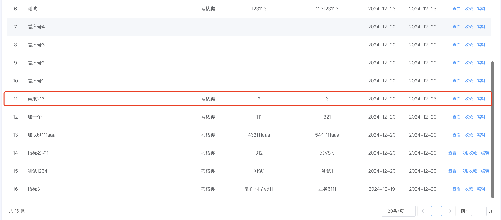

::: info
在`el-table`绘制表格时，由于默认显示数据的高度超过了`el-table`的容器高度，表格默认垂直方向滚动，导致下方有一条不应该出现的底边线。
:::


## 1. 问题解决
```css
/* 隐藏伪元素 */
.el-table::before {
  display: none !important;
}

/* 重现下自带下边框线 */
.el-table--border {
  border-bottom: 1px solid #fff !important;
}
``` 