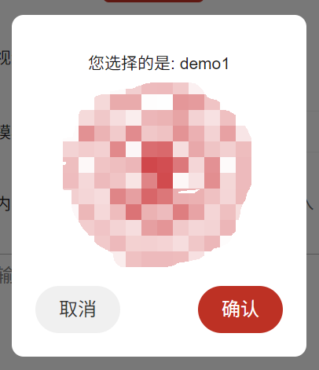

- 父组件
:::details
```vue
<template>
  <view class="form-area-item">
    <text class="form-area-item-text">选择模板</text>
    <uni-data-select v-model="modelIndex" :localdata="array" @change="bindPickerChange"></uni-data-select>
    <CustomModal :visible="isModalVisible" :message="modalMessage" :imageSrc="modalImageSrc" @confirm="onConfirm"
      @cancel="onCancel" />
  </view>
</template>
<script>
export default{
  methods:{
    bindPickerChange(e) {
      const tempOption = this.array.find(item => item.value == e).text;
      this.modalMessage = `您选择的是: ${tempOption}`;
      this.modalImageSrc = '../static/images/xijiao/avator.png';
      this.isModalVisible = true;
      this.modelIndex = e
    },
  }
}
</script>
```
:::


- 自定义组件
  
:::details
```vue
<template>
	<view class="modal" v-if="visible">
		<view class="modal-content">
			<text class="mes-text">{{ message }}</text>
			<image :src="imageSrc" class="modal-image" mode="aspectFit" />
			<view class="modal-buttons">
				<button class="login-btn cu-btn block bg-gray lg round" @click="onCancel">取消</button>
				<button class="login-btn cu-btn block bg-red lg round" @click="onConfirm">确认</button>
			</view>
		</view>
	</view>
</template>

<script>
	export default {
		props: {
			visible: {
				type: Boolean,
				default: false
			},
			message: {
				type: String,
				default: ''
			},
			imageSrc: {
				type: String,
				default: ''
			}
		},
		methods: {
			onConfirm() {
				this.$emit('confirm');
			},
			onCancel() {
				this.$emit('cancel');
			}
		}
	};
</script>

<style>
	.modal {
		position: fixed;
		top: 0;
		left: 0;
		right: 0;
		bottom: 0;
		background: rgba(0, 0, 0, 0.5);
		display: flex;
		justify-content: center;
		align-items: center;
		z-index: 9999;
	}

	.modal-content {
		background: white;
		padding: 20px;
		border-radius: 10px;
		text-align: center;
		width: 250px;
		display: flex;
		align-items: center;
		flex-direction: column;
	}
	.mes-text{
		margin: 10px 0;
	}
	.modal-image {
		display: block;
		width: 150px;
		height: 150px;
	}

	.modal-buttons {
		margin-top: 20px;
		width: 100%;
		display: flex;
		justify-content: space-between;
	}
</style>
```
:::

- 效果如下：

