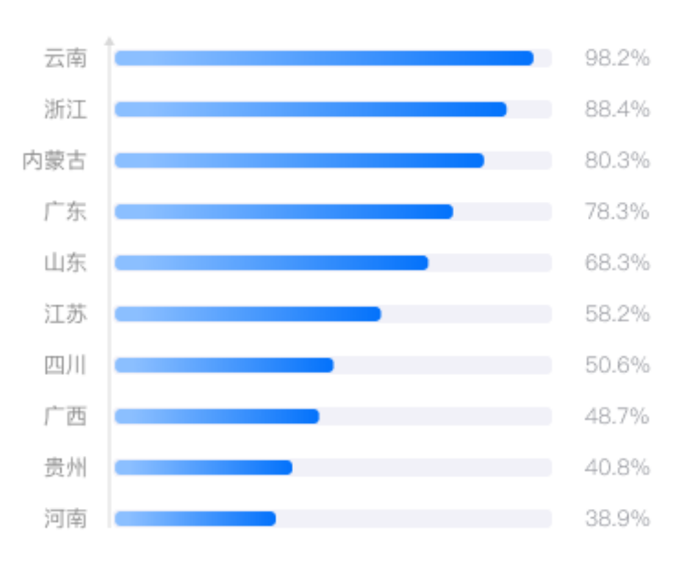
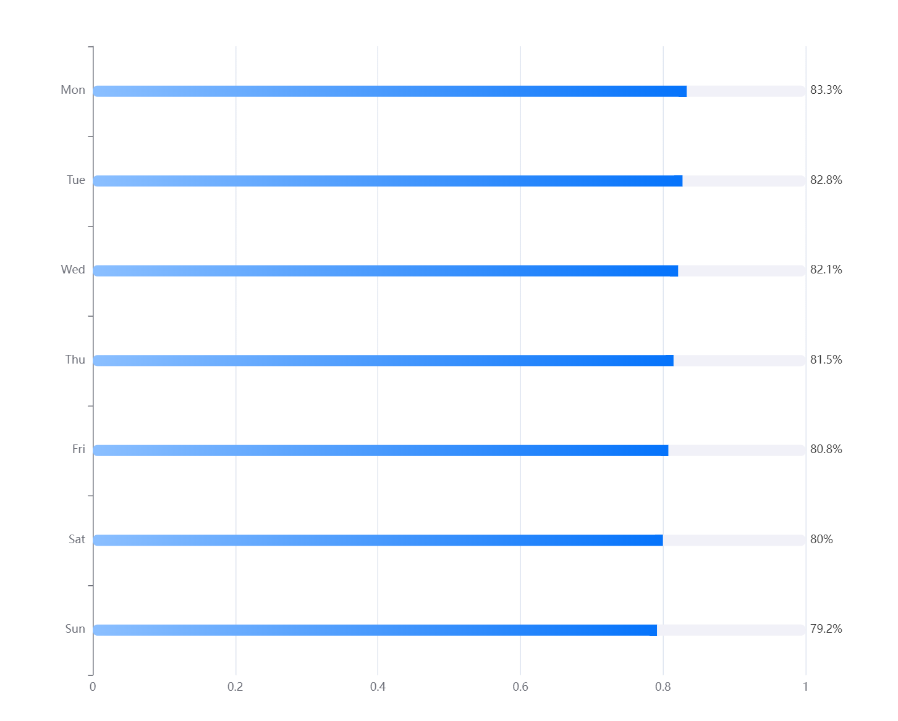

:::info 需求
一个全国各省数据从高到低排列的图表，默认显示前十条，向下滚动可以继续展示更多数据，echarts图表很难实现需求图的一比一还原，所以手绘的还原度会更高。
:::



## 手绘方案
```vue
<template>
  <div class="area-index" :key="tradeStamp" v-if="showEcharts6">
    <div class="vertical-line">
      <div class="triangle-top"></div>
    </div>
    <div class="every-his">
      <div
        v-for="(item, index) in trdAreaAnalysisData.list_tra"
        :key="index"
        class="every-his-item"
      >
        <div class="item-name">{{ item.prov }}</div>
        <div class="item-block">
          <div
            :style="{
              width:
                (item.set_amt / trdAreaAnalysisData.max_tra) * 95 + '%',
            }"
          ></div>
        </div>
        <div class="item-value">{{ item.set_amt.toFixed(2) }}</div>
      </div>
    </div>
  </div>
</template>
<style scoped lang="scss">
.area-index {
  width: 100%;
  height: calc(100% - 150px);
  overflow-y: auto;
  position: relative;

  .vertical-line {
    position: relative;
    width: 2px;
    height: 300%;
    background-color: #ccc;
    margin: 10px 100px;
    z-index: 999;

    .triangle-top {
      position: absolute;
      top: -8px;
      left: 50%;
      transform: translateX(-50%);
      width: 0;
      height: 0;
      border-left: 8px solid transparent;
      border-right: 8px solid transparent;
      border-bottom: 8px solid #ccc;
      /* 三角形底部颜色与竖线一致 */
    }
  }

  .every-his {
    position: absolute;
    top: 0;
    width: 100%;
    height: 95%;
    margin-top: 2%;

    .every-his-item {
      display: flex;
      height: 10%;
      align-items: center;

      .item-name {
        width: 90px;
        text-align: right;
      }

      .item-block {
        width: calc(100% - 200px);
        height: 10px;
        border-radius: 3px;
        background: #f1f1f8;
        margin-left: 15px;
        position: relative;

        div {
          position: absolute;
          top: 0;
          left: 0;
          background-image: linear-gradient(to right, #96c4fe, #0472fb);
          border-radius: 3px;
          height: 10px;
        }
      }

      .item-value {
        width: 50px;
        margin-left: 20px;
      }
    }
  }
}
</style>
```

## echarts方案（还原度不够，慎用）


```js
const rawData = [
  [500, 480, 460, 440, 420, 400, 380],
  [100, 100, 100, 100, 100, 100, 100]
];
const totalData = [];
for (let i = 0; i < rawData[0].length; ++i) {
  let sum = 0;
  for (let j = 0; j < rawData.length; ++j) {
    sum += rawData[j][i];
  }
  totalData.push(sum);
}
const grid = {
  left: 100,
  right: 100,
  top: 50,
  bottom: 50
};
const series = ['Direct', 'Mail Ad'].map((name, sid) => {
  return {
    name,
    type: 'bar',
    stack: 'total',
    barWidth: '12px',
    itemStyle: {
      borderRadius: name == 'Direct' ? [5, 0, 0, 5] : [0, 5, 5, 0],
      color:
        name == 'Direct'
          ? new echarts.graphic.LinearGradient(0, 1, 1, 0, [
              { offset: 0, color: '#8BBFFF' },
              { offset: 1, color: '#0573FB' }
            ])
          : '#F1F1F8'
    },
    label: {
      show: name == 'Direct' ? false : true,
      position: 'right',
      formatter: (params) => {
        return Math.round((1 - params.value) * 1000) / 10 + '%';
      }
    },
    data: rawData[sid].map((d, did) =>
      totalData[did] <= 0 ? 0 : d / totalData[did]
    ).reverse()
  };
});

option = {
  grid,
  xAxis: {
    type: 'value',
  },
  // 
  yAxis: {
    type: 'category',
    data: ['Mon', 'Tue', 'Wed', 'Thu', 'Fri', 'Sat', 'Sun'].reverse()
  },
  tooltip: {
    trigger: 'axis',
    axisPointer: {
      type: 'shadow' 
    },
    formatter: function (params) {
      var tooltipText = params[0].name + '<br/>'; 
      var total = 0; 
      for (var i = 0, len = params.length; i < len; i++) {
        total += params[i].value;
      }
      tooltipText +=
        '<span style="display:inline-block;width:8px;height:8px;background-color:' +
        '#5470C6' +
        ';border-radius:50%;margin-right:5px;"></span>' +
        params[0].seriesName +
        ': ' +
        ((params[0].value / total) * 100).toFixed(2) +
        '%';
      return tooltipText;
    }
  },
  series
};
```

