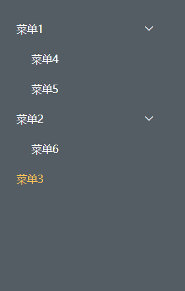
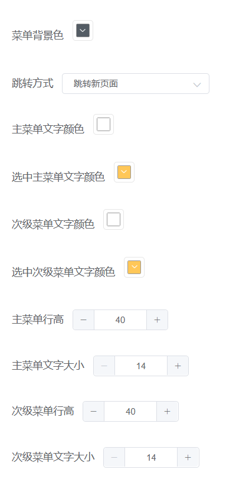

:::info
可视化大屏中有一个组件是导航菜单组件，该组件需要满足：
1. 菜单层级无限制，从数据库获取完整菜单列表。
2. 主菜单和次级菜单可以自定义样式，包括背景色、文字颜色、选中文字颜色、行高以及文字大小。
3. 菜单有子菜单时显示展开-收缩的箭头，无子菜单时隐藏此icon。
4. 可以通过配置项选择在激活菜单跳转页面时是打开新的窗口还是在原本的页面跳转。

因为使用`element-ui`的`menu`组件时，样式修改比较复杂，且使用递归组件的写法时，无法根据有无子菜单显示icon，所以选择自己封装了一个菜单组件，自定义程度比较高，可以根据项目需求定义菜单样式以及适配项目需求。

注意：递归组件中如有调用父子组件的方法，需使用事件总线EventBus。
:::

- 父组件
  ::: details 点击查看代码
  ```html
  <div :style="navMenuStyle" class="nav-menu">
    <menu-tree :menuList="menuList" :module="module">
    </menu-tree>
  </div>
  ```

  ```js
  data() {
    return {
      menuList:[
        {
          menu_id: "100",
          menu_name: "菜单1",
          url: "",
          index: 1,
          isFold: true,
          isSelect: false,
          children: [
            {
              menu_id: "400",
              menu_name: "菜单4",
              url: "",
              isFold: true,
              isSelect: false,
              children: []
            },
            {
              menu_id: "500",
              menu_name: "菜单5",
              url: "https://y.qq.com/",
              isFold: true,
              isSelect: false,
              children: []
            }
          ]
        },
        {
          menu_id: "200",
          menu_name: "菜单2",
          url: "",
          index: 1,
          isFold: true,
          isSelect: false,
          children: [
            {
              menu_id: "600",
              menu_name: "菜单6",
              url: "http://www.baidu.com",
              isFold: false,
              isSelect: false,
              children: []
            }
          ]
        },
        {
          menu_id: "300",
          menu_name: "菜单3",
          url: "",
          index: 1,
          isFold: true,
          isSelect: false,
          children: []
        }
      ],
      module:{
        menuParentId:"1", 
        menuBgColor:'#545C64',
        menuContentColor:'#fff',
        selectContentColor:'#FFC758',
        menuHeight:40,
        menuFontSize:14,
        mainContentColor:'#fff',
        mainSelectContentColor:'#FFC758',
        mainMenuHeight:40,
        mainMenuFontSize:14,
        turnType:'newPage'
      }
    }
  },
  computed: {
    navMenuStyle() {
      return {
        '--background-color': this.module.menuBgColor ? this.module.menuBgColor : '#fff'
      }
    }
  },
  ```
  :::

- 子组件
  ::: details 点击查看代码
  ```html
  <div style="width:200px">
    <div v-for="(menu, index) in menuList" :key="index" class="main-menu">
      <div class="menu-contant" :style="nextMenuStyle(menu)" @click="getSelect(menu)">
        <span>{{ menu.menu_name }}</span>
        <i :class="menu.isFold ? 'el-icon-arrow-right' : 'el-icon-arrow-down'" v-if="menu.children"></i>
      </div>
      <menu-tree :menuList="menu.children" v-if="!menu.isFold" style="padding-left:20px" :module="module"></menu-tree>
    </div>
  </div>
  ```

  ```js
  data() {
    return {
      isFold: true,
      nextMenuList: [],
    }
  },
  // 根据配置项显示菜单样式，如不需要用户自己配置，可省略这些内容
  nextMenuStyle(menu) {
    if (menu.index !== 1) {
      return {
        '--color': menu.isSelect ? this.module.selectContentColor : this.module.menuContentColor,
        '--height': this.module.menuHeight + 'px',
        '--font-size': this.module.menuFontSize + 'px'
      }
    } else {
      return {
        '--color': menu.isSelect ? this.module.mainSelectContentColor : this.module.mainContentColor,
        '--height': this.module.mainMenuHeight + 'px',
        '--font-size': this.module.mainMenuFontSize + 'px'
      }
    }
  },
  // 1.点击查询展开跳转事件放在一起，根据有无URL判断是否跳转；2.箭头方向更改
  getFold(data) {
    let key = data.menu_id
    data.isFold = !data.isFold
    this.testModule(key)
  },
  getSelect(data) {
    this.getFold(data)
    this.select(this.menuList, data.menu_id)
    if (data.url && data.url.length) {
      if (this.module.turnType == 'currentPage') {
        window.location.href = data.url
      } else if (this.module.turnType == 'newPage') {
        window.open(data.url)
      }
    } else {
      return
    }
  },
  async testModule(key) {
    let datajson = this.menuList
    this.getChildData(datajson, key)
    if ((this.nextMenuList && this.nextMenuList.length == 0) || this.nextMenuList == undefined) {
      this.delete(this.menuList, key)
    }
    this.toTree(this.nextMenuList, this.menuList, key)
  },
  getChildData(datajson, key) {
    datajson.forEach((item) => {
      if (item.menu_id == key) {
        this.nextMenuList = item.children
      }
      if (item.children && item.children.length) {
        this.getChildData(item.children, key)
      }
    })
  },
  delete(children, key) {
    if (children) {
      children.forEach(it => {
        if (it.menu_id == key) {
          delete it.children
        } else {
          this.delete(it.children, key)
        }
      })
    } else { return }
  },
  select(list, key) {
    if (list && list.length) {
      list.forEach(item => {
        if (item.menu_id == key) {
          item.isSelect = true
          this.unSelect(item.children)
        } else {
          item.isSelect = false
          this.select(item.children, key)
        }
      })
    } else {
      return
    }
  },
  unSelect(list) {
    if (list && list.length) {
      list.forEach(item => {
        item.isSelect = false
        this.unSelect(item.children)
      })
    } else {
      return
    }
  },
  toTree(arrs, that, key) {
    if (arrs != undefined && arrs.length == 0) {
      return
    } else {
      let obj = {}
      if (that && that.length) {
        that.forEach((item, index) => {
          if (item.menu_name === key) {
            if (item.children && item.children.length == 0) {
              item.isFold = !item.isFold
              if (arrs != undefined && arrs.length) {
                arrs.map((it, index) => {
                  obj[menu_id] = it[menu_id]
                  obj[menu_name] = it[menu_name]
                  obj[url] = it[url] ? it[url] : ''
                  obj.isFold = false
                  obj.isSelect = false
                  obj.children = []
                  item.children.push(JSON.parse(JSON.stringify(obj)))
                })
              }
              return
            } else {
              return
            }
            return
          } else {
            this.toTree(arrs, item.children, key)
          }
        })
      }
    }
  }
  ```
  :::

- 菜单效果
  
  
- 配置项
  
  