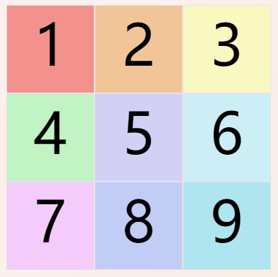
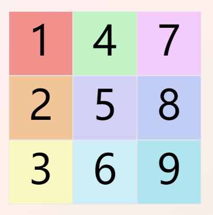
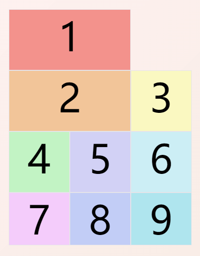
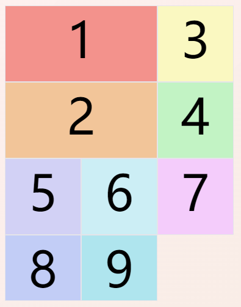
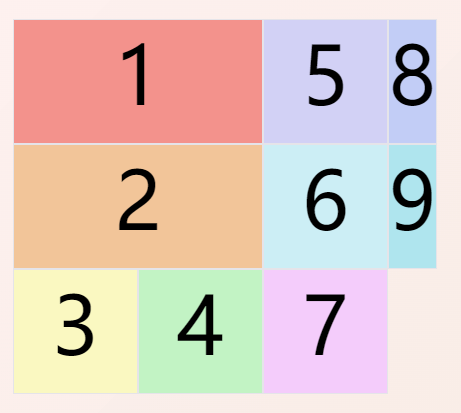
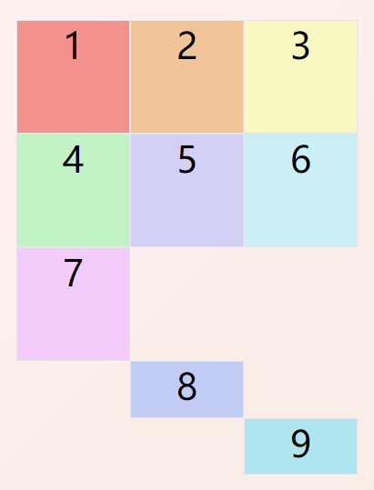
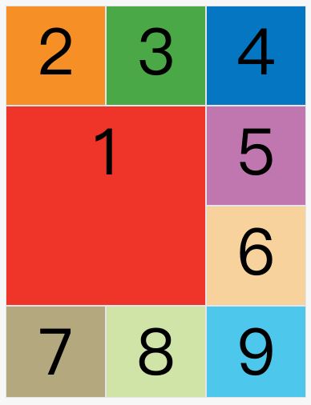
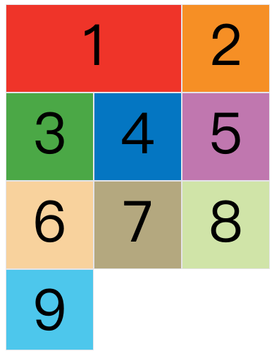
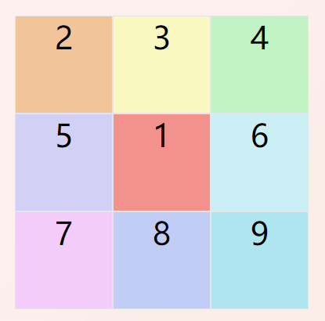

## 1.概述
- 将网页划分成一块块网格，可任意组合。
- 与flex布局类似，但是flex布局只支持固定轴线的布局，或者称为一维布局；grid布局可以把容器划分为行和列，形成单元格，相当于二维布局。

## 2.基本概念

### 2.1 container和item
- 采用grid布局的区域称为container，容器内采用grid定位的子元素称为item

```html
<div class="container">
  <div><span>山</span></div>
  <div><span>河</span></div>
  <div><span>湖</span></div>
  <div><span>海</span></div>
</div>
```
- 上述代码中，最外层的`<div>`元素就是container，内层的四个`<div>`就是item
  
### 2.2 行和列
- container内水平区域称为行（`row`），垂直区域称为列（`column`）
  
### 2.3 单元格
- 行和列的交叉区域形成单元格，称为单元格（`cell`）

### 2.4 网格线
- 划分网格的线
- `n`行有`n+1`根水平网格线，`n`列有`n+1`根垂直网格线

## 3.container属性

### 3.1 display属性
```css
.container {
  display:grid; // 指定该div使用网格布局，该情况下div为块级元素
}
```

```css
.container {
  display:inline-grid; // 该情况下div为行内元素
}
```
- 注意，设为网格布局以后，容器子元素的`float、display: inline-block、display: table-cell、vertical-align和column-*`等设置都将失效。

### 3.2 grid-template-columns 属性，grid-template-rows 属性
- `grid-template-columns`属性定义每一列的列宽，`grid-template-rows`属性定义每一行的行高。

```css
.container {
  display: grid;
  grid-template-columns: 100px 100px 100px;
  grid-template-rows: 100px 100px 100px;
}
```
> 上述代码，指定了一个布局为`3×3`，9个单元格行高和列宽均为`100px`的网格布局区域
  
```css
.container {
  display: grid;
  grid-template-columns: 33.33% 33.33% 33.33%;
  grid-template-rows: 33.33% 33.33% 33.33%;
}
```
> 上述代码表明，行高和列宽除了可以使用绝对单位，也可以使用百分比
  
#### 3.2.1 repeat()
- 网格很多时，重复写同样的值非常麻烦。这时可以使用`repeat()`函数，简化重复的值。上面的代码用`repeat()`改写如下。
  
```css
.container {
  display: grid;
  grid-template-columns: repeat(3, 33.33%);
  grid-template-rows: repeat(3, 33.33%);
}
```
- `repeat()`内两个参数，第一个参数是重复的次数（上例是3），第二个参数是所要重复的值。
- `repeat()`也可以用来重复某种模式，如下代码所示。
`grid-template-columns: repeat(2, 100px 20px 80px);`
>该行代码表明，一共有六列的网格，宽度以`100px`，`20px`，`80px`为一组循环两次

#### 3.2.2 auto-fill 关键字
- 当单元格的大小是固定的，但是容器的大小不确定时，如果希望每一行（或每一列）容纳尽可能多的单元格，这时可以使用`auto-fill`关键字表示自动填充,直到容器不能放置更多的列。

```css
.container {
  display: grid;
  grid-template-columns: repeat(auto-fill, 100px);
}
```

#### 3.2.3 auto-fit关键字
- `auto-fit`和`auto-fill`的行为基本是相同的。只有当容器足够宽，可以在一行容纳所有单元格，并且单元格宽度不固定的时候，才会有行为差异：`auto-fill`会用空格子填满剩余宽度，`auto-fit`则会尽量扩大单元格的宽度。

#### 3.2.4 fr关键字
- 该关键字表示比例关系，为`fraction`的缩写，如果两列的宽度分别为`1fr`和`2fr`，就表示后者是前者的两倍。如下：

```css
.container {
  display: grid;
  grid-template-columns: 1fr 2fr;
}
```
- `fr`可以与绝对长度的单位结合使用，如下代码表示，在容器内，第一列的宽度为`150px`，在容器剩余的宽度中，第二列的宽度为第三列宽度的一半

```css
.container {
  display: grid;
  grid-template-columns:150px 1fr 2fr;
}
```

#### 3.2.5 minmax()
- `minmax()`函数产生一个长度范围，表示长度就在这个范围之中。它接受两个参数，分别为最小值和最大值。
`grid-template-columns: 1fr 1fr minmax(100px, 1fr);`
>如上述代码中，`minmax(100px, 1fr)`表示列宽不小于`100px`，不大于`1fr`。

#### 3.2.6 auto关键字
- `auto`关键字表示由浏览器自己决定长度。
`grid-template-columns: 100px auto 100px;`
>在上述代码中，第二列的宽度，基本上等于该列单元格的最大宽度，除非单元格内容设置了`min-width`，且这个值大于最大宽度。

#### 3.2.7 网格线的名称
- `grid-template-columns`属性和`grid-template-rows`属性里面，还可以使用方括号，指定每一根网格线的名字，方便以后的引用。

```css
.container {
  display: grid;
  grid-template-columns: [c1] 100px [c2] 100px [c3] auto [c4];
  grid-template-rows: [r1] 100px [r2] 100px [r3] auto [r4];
}
```
- 网格布局允许同一根线有多个名字，比如`[fifth-line row-5]`

### 3.3 row-gap 属性，column-gap 属性，gap 属性

- `row-gap`属性设置行与行的间隔（行间距），`column-gap`属性设置列与列的间隔（列间距）。

```css
.container {
  row-gap: 20px;
  column-gap: 20px;
}
```

- `gap`属性是`column-gap`和`row-gap`的合并简写形式，语法如下：
`gap: <row-gap> <column-gap>;`
```css
.container {
  gap: 20px 20px;
}
```

### 3.4 grid-template-areas 属性
- 网格布局允许指定"区域"（area），一个区域由单个或多个单元格组成。grid-template-areas属性用于定义区域。

```css
.container {
  display: grid;
  grid-template-columns: 100px 100px 100px;
  grid-template-rows: 100px 100px 100px;
  grid-template-areas: 'a b c'
                       'd e f'
                       'g h i';
}
```
> 上面代码先划分出9个单元格，然后将其定名为a到i的九个区域，分别对应这九个单元格。

- 多个单元格合并成一个区域的写法如下：
```css
.container {
  display: grid;
  grid-template-columns: 100px 100px 100px;
  grid-template-rows: 100px 100px 100px;
  grid-template-areas: "header header header"
                      "main main main"
                      "footer footer footer";
}
```
> 上面代码中，顶部是页眉区域`header`，底部是页脚区域`footer`，中间部分则为`main`
- 如果某些区域不需要利用，则使用"点"`（.）`表示。
```css
grid-template-areas: 'a . c'
                     'd . f'
                     'g . i';
```
> 上面代码中，中间一列为点，表示没有用到该单元格，或者该单元格不属于任何区域。

- 注意，区域的命名会影响到网格线。每个区域的起始网格线，会自动命名为区域名`-start`，终止网格线自动命名为区域名`-end`。比如，区域名为`header`，则起始位置的水平网格线和垂直网格线叫做`header-start`，终止位置的水平网格线和垂直网格线叫做`header-end`。

### 3.5 grid-auto-flow 属性
- 划分网格以后，容器的子元素会按照顺序，自动放置在每一个网格。默认的放置顺序是"先行后列"，即先填满第一行，再开始放入第二行


- 这个顺序由`grid-auto-flow`属性决定，默认值是`row`，即"先行后列"。也可以将它设成`column`，变成"先列后行"。


- `grid-auto-flow`还可以设成`row dense`和`column dense`，这两个值主要用于，某些项目指定位置以后，剩下的项目怎么自动放置。
  
> 下面的例子让1号项目和2号项目各占据两个单元格，然后在默认的grid-auto-flow: row情况下，会产生下面这样的布局：


 
> 修改设置，设为`row dense`，表示"先行后列"，并且尽可能紧密填满，尽量不出现空格，会产生下面这样的布局：



> 如果将设置改为`column dense`，表示"先列后行"，并且尽量填满空格，会产生下面这样的布局：



### 3.6 justify-items 属性，align-items 属性，place-items 属性

- `justify-items`属性设置单元格内容的水平位置（左中右），`align-items`属性设置单元格内容的垂直位置（上中下），两者可设置的值相同，如下所示。
```css
.container {
  justify-items: start | end | center | stretch;
  align-items: start | end | center | stretch;
}
```
> - `start`：对齐单元格的起始边缘。
> - `end`：对齐单元格的结束边缘。
> - `center`：单元格内部居中。
> - `stretch`：拉伸，占满单元格的整个宽度（默认值）。

- `place-items`属性是`align-items`属性和`justify-items`属性的合并简写形式。
`place-items: <align-items> <justify-items>;`
如：`place-items: start end;`

### 3.7 justify-content 属性，align-content 属性，place-content 属性

- `justify-content`属性是整个内容区域在容器里面的水平位置（左中右），`align-content`属性是整个内容区域的垂直位置（上中下），两者可设置的值相同，如下所示。

```css
.container {
  justify-content: start | end | center | stretch | space-around | space-between | space-evenly;
  align-content: start | end | center | stretch | space-around | space-between | space-evenly;  
}
```
> - `start` - 对齐容器的起始边框。
> - `end` - 对齐容器的结束边框。
> - `center` - 容器内部居中。
> - `stretch` - 项目大小没有指定时，拉伸占据整个网格容器。
> - `space-around` - 每个项目两侧的间隔相等。所以，项目之间的间隔比项目与容器边框的间隔大一倍。
> - `space-between` - 项目与项目的间隔相等，项目与容器边框之间没有间隔。
> - `space-evenly` - 项目与项目的间隔相等，项目与容器边框之间也是同样长度的间隔。

- `place-content`属性是`align-content`属性和`justify-content`属性的合并简写形式。
  `place-content: <align-content> <justify-content>`
  如：`place-content: space-around space-evenly;`

### 3.8 grid-auto-columns 属性，grid-auto-rows 属性

- 有时候，一些项目的指定位置，在现有网格的外部。比如网格只有3列，但是某一个项目指定在第5行。这时，浏览器会自动生成多余的网格，以便放置项目。
- `grid-auto-columns`属性和`grid-auto-rows`属性用来设置浏览器自动创建的多余网格的列宽和行高。它们的写法与`grid-template-columns`和`grid-template-rows`完全相同。如果不指定这两个属性，浏览器完全根据单元格内容的大小，决定新增网格的列宽和行高。
```css
 .container {
  display: grid;
  grid-template-columns: 100px 100px 100px;
  grid-template-rows: 100px 100px 100px;
  grid-auto-rows: 50px; 
}
```


## 4.item属性

### 4.1 grid-column-start 属性，grid-column-end 属性，grid-row-start 属性，grid-row-end 属性

- 项目的位置是可以指定的，具体方法就是指定项目的四个边框，分别定位在哪根网格线。
> - grid-column-start属性：左边框所在的垂直网格线
> - grid-column-end属性：右边框所在的垂直网格线
> - grid-row-start属性：上边框所在的水平网格线
> - grid-row-end属性：下边框所在的水平网格线

```css
.item-1 {
  grid-column-start: 1;
  grid-column-end: 3;
  grid-row-start: 2;
  grid-row-end: 4;
}
```


- 这四个属性的值，除了指定为第几个网格线，还可以指定为网格线的名字。
  
```css
.item-1 {
  grid-column-start: header-start;
  grid-column-end: header-end;
}
```

- 这四个属性的值还可以使用`span`关键字，表示"跨越"，即左右边框（上下边框）之间跨越多少个网格。
```css
.item-1 {
  grid-column-start: span 2;
}
```


### 4.2 grid-column 属性，grid-row 属性

- `grid-column`属性是`grid-column-start`和`grid-column-end`的合并简写形式，`grid-row`属性是`grid-row-start`属性和`grid-row-end`的合并简写形式。

```css
.item {
  grid-column: <start-line> / <end-line>;
  grid-row: <start-line> / <end-line>;
}
```
```css
.item-1 {
  grid-column: 1 / 3;
  grid-row: 1 / 2;
}
/* 等同于 */
.item-1 {
  grid-column-start: 1;
  grid-column-end: 3;
  grid-row-start: 1;
  grid-row-end: 2;
}
```
- 这两个属性之中，也可以使用`span`关键字，表示跨越多少个网格。

```css
.item-1 {
  background: #b03532;
  grid-column: 1 / 3;
  grid-row: 1 / 3;
}
/* 等同于 */
.item-1 {
  background: #b03532;
  grid-column: 1 / span 2;
  grid-row: 1 / span 2;
}
```
- 斜杠以及后面的部分可以省略，默认跨越一个网格。

```css
.item-1 {
  grid-column: 1;
  grid-row: 1;
}
```

### 4.3 grid-area 属性

- `grid-area`属性指定项目放在哪一个区域。

```css
.item-1 {
  grid-area: e;
}
```


- `grid-area`属性还可用作`grid-row-start`、`grid-column-start`、`grid-row-end`、`grid-column-end`的合并简写形式，直接指定项目的位置。
```css
.item {
  grid-area: <row-start> / <column-start> / <row-end> / <column-end>;
}
```
```css
.item-1 {
  grid-area: 1 / 1 / 3 / 3;
}
```
### 4.4 justify-self 属性，align-self 属性，place-self 属性

- `justify-self`属性设置单元格内容的水平位置（左中右），跟`justify-items`属性的用法完全一致，但只作用于单个项目。
- `align-self`属性设置单元格内容的垂直位置（上中下），跟`align-items`属性的用法完全一致，也是只作用于单个项目。

```css
.item {
  justify-self: start | end | center | stretch;
  align-self: start | end | center | stretch;
}
```
> - start：对齐单元格的起始边缘。
> - end：对齐单元格的结束边缘。
> - center：单元格内部居中。
> - stretch：拉伸，占满单元格的整个宽度（默认值）。

- `place-self`属性是`align-self`属性和`justify-self`属性的合并简写形式。
`place-self: <align-self> <justify-self>;`
如：`place-self: center center;`

---

> 文档内容参考https://www.ruanyifeng.com/blog/2019/03/grid-layout-tutorial.html