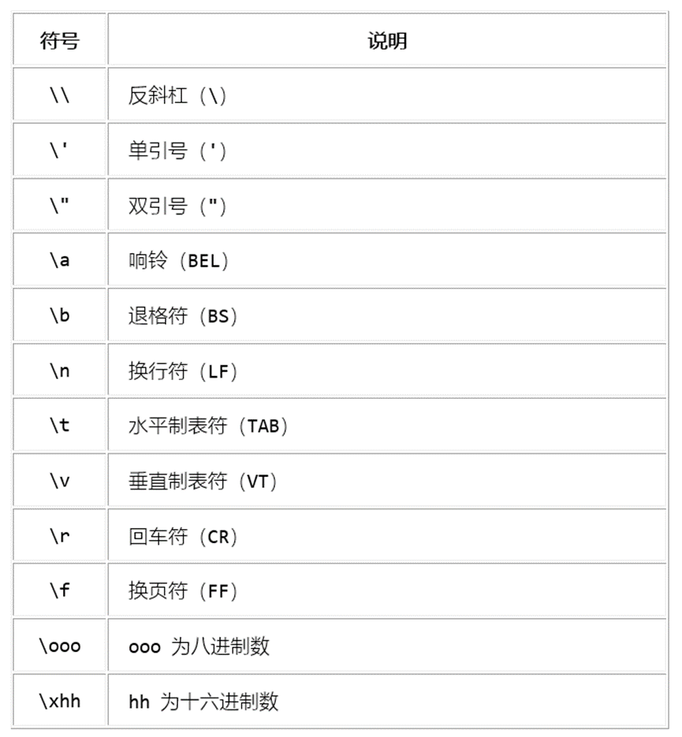
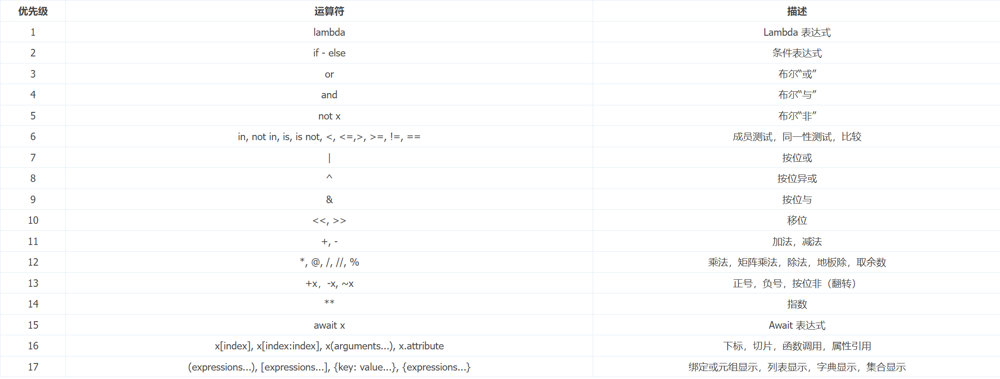

## 1. python变量
- 变量命名规则：字母、数字、下划线，不能以数字开头，不能使用python关键字。
- 不需要像js一样使用`var`、`let`、`const`来声明变量，直接赋值即可，如`x = 3`。

## 2. 字符串
- 字符串是用单引号`'`或双引号`"`括起来的任意文本，如`'hello'`、`"world"`。
- 如果是输出文件路径这种需要频繁添加转义符`\\`的，可以在字符串前加`r`，表示原始字符串，如`print(r"D:\three\two\one\now")`。


- 输出多行字符串时可以使用`\n\`表示输出内容没有结束，也可以使用`triple quoted`，即三个单引号或三个双引号，代码如下：
```python
poetry = """
我是一个诗人
我写了一首诗
"""
print(poetry)
```

- 字符串的加法和乘法
```python
520 + 1314 # 1834
'520' + '1314' # '5201314'

print("hello\n"*3)
# hello
# hello
# hello
```

## 3. `input`函数
- `input`函数用于接收用户输入，返回的是一个字符串。
- 代码如下：
```python
name = input("请输入你的姓名：") #`input`括号内的内容是提示用户输入的内容
print("你好，" + name)
```
- 运行结果如下：
```python
# 请输入你的姓名：怡然
# 你好，怡然
```

## 4. 类型转换
- 类型转换是指将一个数据类型转换为另一个数据类型。
- 代码如下：
```python
x = 3
print(type(x)) # <class 'int'>整型数字
x = str(x)
print(type(x)) # <class 'str'>字符串
x = float(x)
print(type(x)) # <class 'float'> 浮点型
```
- `type`函数可以查看变量的类型。

## 5. 比较运算符
- 比较运算符用于比较两个值，返回的是一个布尔值。
- 代码如下：
```python
x = 3
y = 4
print(x == y) # False
print(x != y) # True
print(x > y) # False
print(x < y) # True
print(x >= y) # False
print(x <= y) # True
```

## 6. 实践
```python
"""这是一个猜数字的小游戏"""
import random # 导入random模块，用于生成随机数
answer = random.randint(1,10) # 生成1到10之间的随机数
counts = 3
while counts > 0: # 当次数大于0时，继续游戏
    temp = input("猜一下我现在心里想的是什么数字")
    guess = int(temp)

    if guess == answer:
        print("你是？？")
        print("猜对也没有奖励")
        break # 猜对了，跳出循环
    else: # 猜错了
        if guess < answer:
            print("小了")
        else:
            print("大了")
        counts = counts - 1
print("游戏结束")
```

## 7. 数字类型
### 7.1 整数
### 7.2 浮点数
- 和js一样的问题，浮点数的比较不能直接使用`==`，因为浮点数的精度问题，如`0.1 + 0.2 != 0.3`。
- 使用decimal(十进制)模块可以解决浮点数的精度问题。

```python
import decimal
a = decimal.Decimal('0.1')
b = decimal.Decimal('0.2')
print(a + b)
0.3
c = decimal.Decimal('0.3')
a + b == c
True
```

### 7.3 科学计数
```python
0.00005
5e-05
```

### 7.4 复数
- 复数是由实部和虚部组成的数，如`3+4j`。
- 实部和虚部可以是整数或浮点数，但是获取到的实部和虚部都是浮点数。
- 虚部的单位是`j`或`J`。
- 代码如下：
```python
a = 3 + 4j
print(a) # (3+4j)
print(a.real) # 3.0
print(a.imag) # 4.0
```

### 7.5 数字的运算
- 数字的运算和js一样，支持加减乘除、取余、取整等运算。
- 代码如下：
```python
a = 3
b = 2
print(a + b) # 5
print(a - b) # 1
print(a * b) # 6
print(a / b) # 1.5
print(a % b) # 1
print(a // b) # 1
```
```python
a = -3
b = 2
print(a // b) # -2 向下取整
```
```python
# divmod函数同时返回商和余数
print(divmod(7,2)) # (3, 1) 商和余数
print(divmod(-3,2)) # (-2, 1) 商和余数

print(abs(-3)) # 3 返回实数的绝对值，或复数的模
print(abs(3+4j)) # 5.0 返回复数的模

int(9.99) # 9 去尾

float(9) # 9.0
float('9.99') # 9.99
float('+1E6') # 1000000.0

complex(3) # (3+0j) 实部是3，虚部是0
complex(3,4) # (3+4j) 实部是3，虚部是4

pow(2,3) # 8 2的3次方
pow(2,3,3) # 2 2的3次方对3取余

x**y # x的y次方
print(2**3) # 8
```

## 8. 布尔类型
- 布尔类型只有`True`和`False`两个值。
- 代码如下：
```python
a = True
b = False
print(a) # True
print(b) # False

bool(0) # False
bool(1) # True
bool(-1) # True
bool(3.14) # True
bool('') # False
bool('hello') # True
bool(' ') # True 空格也为True
bool('False') # True 字符串'False'也为True
bool('True') # True 字符串'True'也为True

True + False = 1
```

- 逻辑运算符
```python
a = True
b = False
print(a and b) # False
print(a or b) # True
print(not a) # False

3 and 4 # 4  and和or都遵循短路逻辑，从左往右，只有当第一个操作数的值无法确定逻辑运算的结果时，才对第二个操作数进行求值。
4 or 5 # 4
'a' and 'b' # 'b'
'a' or '2' # 'a'

((not 1) or (0 and 1) or (3 and 4) or (5 and 6) or (7 and 8 and 9)) # 4
# （False or 0 or 4 or 6 or 9) == 4
```

- 运算符优先级
- 逻辑运算符的优先级：`not` > `and` > `or`
```python
not 1 or 0 and 1 or 3 and 4 or 5 and 6 or 7 and 8 and 9 # 4
```
